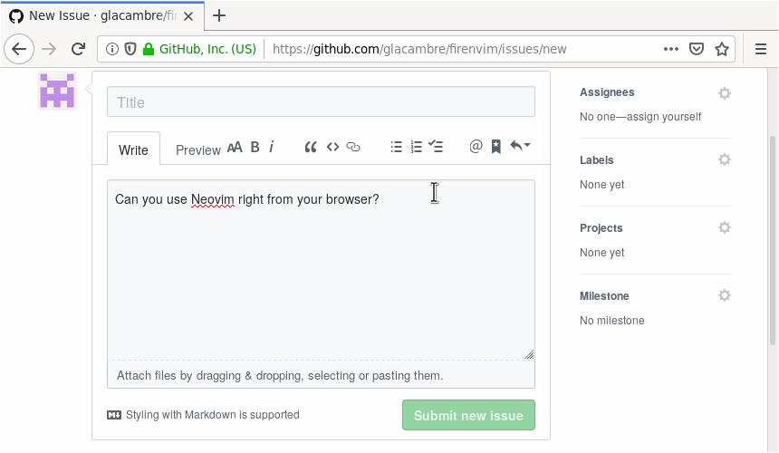

# Firenvim [](https://travis-ci.org/glacambre/firenvim)[](https://lgtm.com/projects/g/glacambre/firenvim/alerts/)

Turn Firefox into a Neovim client.



# How to use

For now, just click on textareas or input fields. When you want to set the content of the textarea to the content of the neovim frame, just `:w`. When you want to close the neovim frame, just `:q`.

# Installing

Before installing anything, please read [SECURITY.md](SECURITY.md) and make sure you're OK with everything mentionned in there. If you think of a way to compromise Firenvim, please send an email (you can find my address in my commits).

## Pre-built

Get the extension from [AMO](https://addons.mozilla.org/en-US/firefox/addon/firenvim/), get the native messenger from the [releases page](https://github.com/glacambre/firenvim/releases). Run the native messenger once in your shell and if it results in `Native messenger successfully installed.` being printed, you're done.

## From source

### Requirements

Installing from source requires nodejs, npm and neovim v.>=0.4

### Cross-browser steps

First, install Firenvim like a regular vim plugin (either by changing your runtime path manually or by using your favourite plugin manager).

Then, run the following commands:
```sh
git clone https://github.com/glacambre/firenvim
cd firenvim
npm install
npm run build
npm run install
```
These commands should create three directories: `target/chrome`, `target/firefox` and `target/xpi`.

### Firefox-specific steps
Go to `about:addons`, click on the cog icon and select `install addon from file` (note: this might require setting `xpinstall.signatures.required` to false in `about:config`).

### Google Chrome/Chromium-specific steps
Go to `chrome://extensions`, enable "Developer mode", click on `Load unpacked` and select the `target/chrome` directory.

### Other browsers
Other browsers aren't supported for now. Opera, Vivaldi and other Chromium-based browsers should however work just like in Chromium and have similar install steps. Brave and Edge might work, Safari doesn't (it doesn't support Webextensions).

# Drawbacks

The main issue with Firenvim is that some keybindings (e.g. `<C-w>`) are not overridable. I circumvent this issue by running a [patched](https://github.com/glacambre/firefox-patches) version of firefox.

# You might also like

- [Tridactyl](https://github.com/tridactyl/tridactyl), provides vim-like keybindings to use Firefox. Also lets you edit input fields and text areas in your favourite editor with its `:editor` command.
- [GhostText](https://github.com/GhostText/GhostText), lets you edit text areas in your editor with a single click. Requires installing a plugin in your editor too. Features live updates!
- [Textern](https://github.com/jlebon/textern), a Firefox addon that lets you edit text areas in your editor without requiring you to install a plugin in your editor.
- [withExEditor](https://github.com/asamuzaK/withExEditor), same thing as Textern, except you can also edit/view a page's source with your editor.
